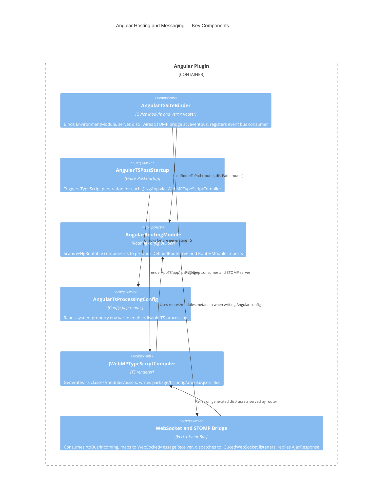

```mermaid
C4Component
    title Angular Hosting and Messaging — Key Components

    Container_Boundary(plugin, "Angular Plugin") {
        Component(siteBinder, "AngularTSSiteBinder", "Guice Module and Vert.x Router", "Binds EnvironmentModule, serves dist/, wires STOMP bridge at /eventbus, registers event bus consumer")
        Component(postStartup, "AngularTSPostStartup", "Guice PostStartup", "Triggers TypeScript generation for each @NgApp via JWebMPTypeScriptCompiler")
        Component(routingModule, "AngularRoutingModule", "Routing config builder", "Scans @NgRoutable components to produce DefinedRoute tree and RouterModule imports")
        Component(processingFlag, "AngularTsProcessingConfig", "Config flag reader", "Reads system property env var to enable/disable TS processing")
        Component(tsCompiler, "JWebMPTypeScriptCompiler", "TS renderer", "Generates TS classes/modules/assets, writes package/tsconfig/angular.json files")
        Component(wsBridge, "WebSocket and STOMP Bridge", "Vert.x Event Bus", "Consumes /toBus/incoming, maps to WebSocketMessageReceiver, dispatches to IGucedWebSocket listeners, replies AjaxResponse")
    }

    Rel(postStartup, processingFlag, "Checks before generating TS")
    Rel(postStartup, tsCompiler, "renderAppTS(app) per @NgApp")
    Rel(tsCompiler, routingModule, "Uses routes/modules metadata when writing Angular config")
    Rel(siteBinder, routingModule, "bindRouteToPath(router, distPath, routes)")
    Rel(siteBinder, wsBridge, "Registers consumer and STOMP server")
    Rel(wsBridge, tsCompiler, "Relies on generated dist/ assets served by router")
```
