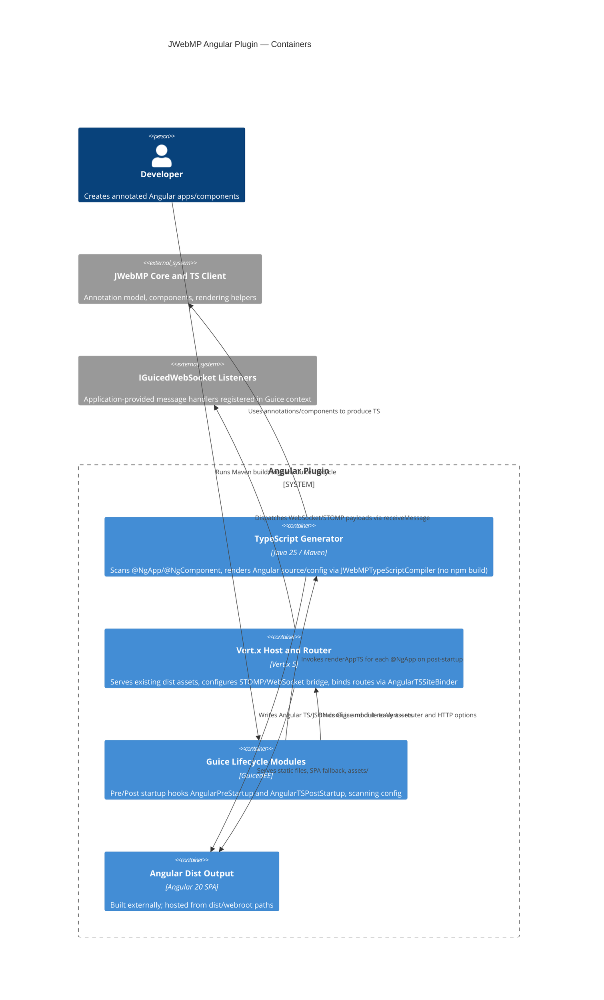

```mermaid
C4Container
    title JWebMP Angular Plugin — Containers

    Person(dev, "Developer", "Creates annotated Angular apps/components")

    System_Boundary(plugin, "Angular Plugin") {
        Container(tsCompiler, "TypeScript Generator", "Java 25 / Maven", "Scans @NgApp/@NgComponent, renders Angular source/config via JWebMPTypeScriptCompiler (no npm build)")
        Container(vertxHost, "Vert.x Host and Router", "Vert.x 5", "Serves existing dist assets, configures STOMP/WebSocket bridge, binds routes via AngularTSSiteBinder")
        Container(guiceLifecycle, "Guice Lifecycle Modules", "GuicedEE", "Pre/Post startup hooks AngularPreStartup and AngularTSPostStartup, scanning config")
        Container(artifacts, "Angular Dist Output", "Angular 20 SPA", "Built externally; hosted from dist/webroot paths")
    }

    System_Ext(jwebmpCore, "JWebMP Core and TS Client", "Annotation model, components, rendering helpers")
    System_Ext(eventListeners, "IGuicedWebSocket Listeners", "Application-provided message handlers registered in Guice context")

    Rel(dev, guiceLifecycle, "Runs Maven build; triggers Guice lifecycle")
    Rel(guiceLifecycle, tsCompiler, "Invokes renderAppTS for each @NgApp on post-startup")
    Rel(tsCompiler, artifacts, "Writes Angular TS/JSON configs and dist-ready assets")
    Rel(guiceLifecycle, vertxHost, "Binds Guice module to Vert.x router and HTTP options")
    Rel(vertxHost, artifacts, "Serves static files, SPA fallback, assets/")
    Rel(vertxHost, eventListeners, "Dispatches WebSocket/STOMP payloads via receiveMessage")
    Rel(tsCompiler, jwebmpCore, "Uses annotations/components to produce TS")
```
