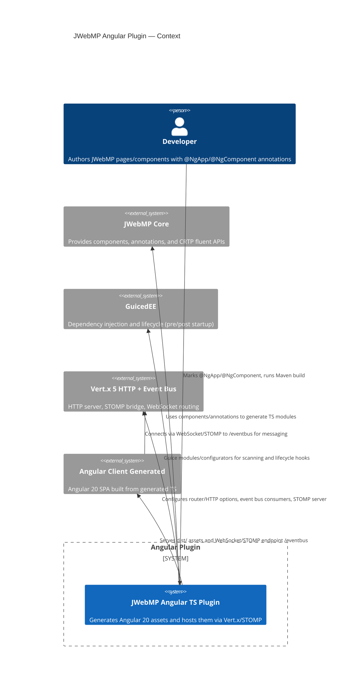

```mermaid
C4Context
    title JWebMP Angular Plugin — Context

    Person(dev, "Developer", "Authors JWebMP pages/components with @NgApp/@NgComponent annotations")
    System_Boundary(plugin, "Angular Plugin") {
        System(system, "JWebMP Angular TS Plugin", "Generates Angular 20 assets and hosts them via Vert.x/STOMP")
    }

    System_Ext(jwebmpCore, "JWebMP Core", "Provides components, annotations, and CRTP fluent APIs")
    System_Ext(guicedee, "GuicedEE", "Dependency injection and lifecycle (pre/post startup)")
    System_Ext(vertx, "Vert.x 5 HTTP + Event Bus", "HTTP server, STOMP bridge, WebSocket routing")
    System_Ext(ngClient, "Angular Client Generated", "Angular 20 SPA built from generated TS")

    Rel(dev, system, "Marks @NgApp/@NgComponent, runs Maven build")
    Rel(system, jwebmpCore, "Uses components/annotations to generate TS modules")
    Rel(system, guicedee, "Guice modules/configurators for scanning and lifecycle hooks")
    Rel(system, vertx, "Configures router/HTTP options, event bus consumers, STOMP server")
    Rel(system, ngClient, "Serves dist/ assets and WebSocket/STOMP endpoint /eventbus")
    Rel(ngClient, vertx, "Connects via WebSocket/STOMP to /eventbus for messaging")
```
