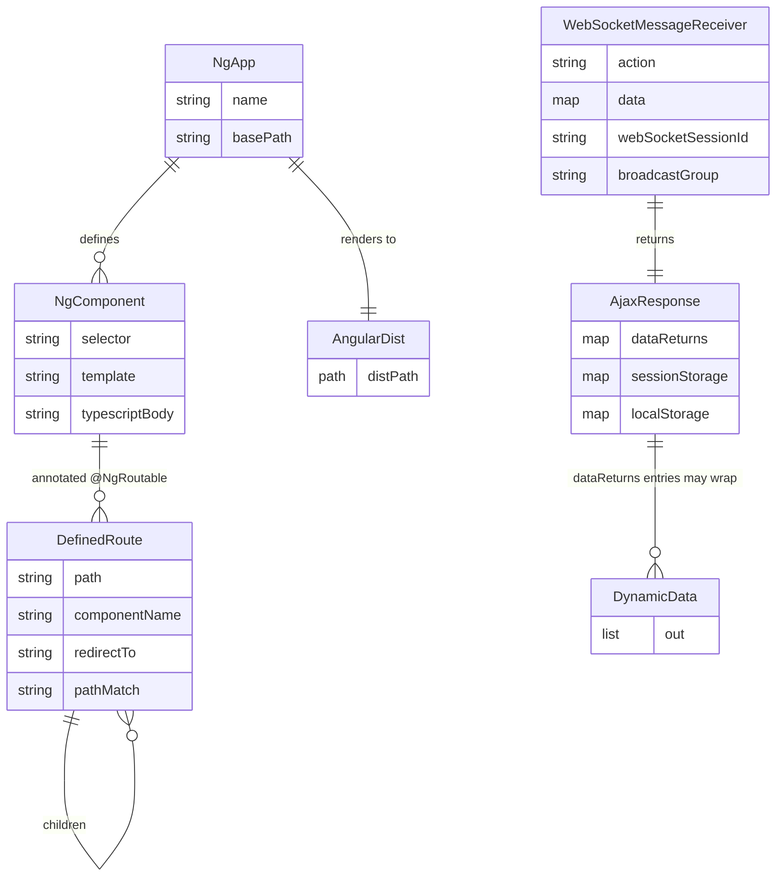

```mermaid
erDiagram
    NgApp ||--o{ NgComponent : defines
    NgComponent ||--o{ DefinedRoute : "annotated @NgRoutable"
    DefinedRoute ||--o{ DefinedRoute : children
    WebSocketMessageReceiver ||--|| AjaxResponse : returns
    AjaxResponse ||--o{ DynamicData : "dataReturns entries may wrap"
    NgApp ||--|| AngularDist : "renders to"

    NgApp {
        string name
        string basePath
    }
    NgComponent {
        string selector
        string template
        string typescriptBody
    }
    DefinedRoute {
        string path
        string componentName
        string redirectTo
        string pathMatch
    }
    WebSocketMessageReceiver {
        string action
        map data
        string webSocketSessionId
        string broadcastGroup
    }
    AjaxResponse {
        map dataReturns
        map sessionStorage
        map localStorage
    }
    DynamicData {
        list out
    }
    AngularDist {
        path distPath
    }
```
