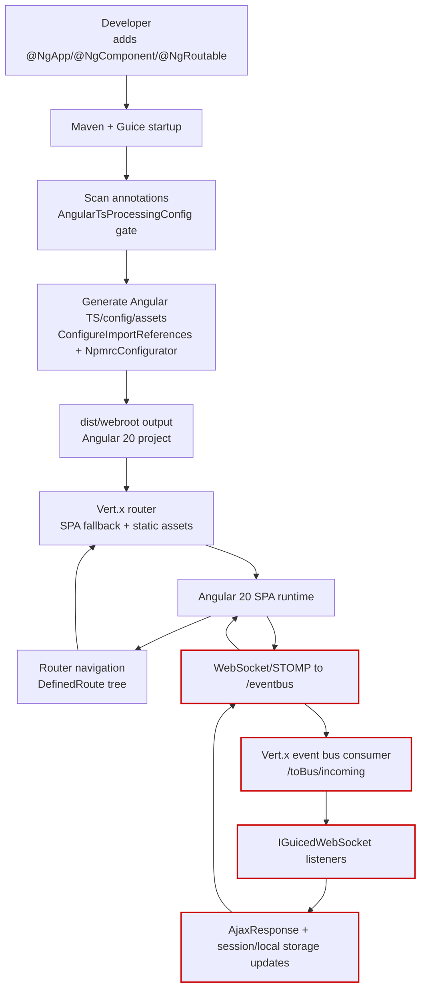

```mermaid
flowchart TD
    Dev[Developer<br/>adds @NgApp/@NgComponent/@NgRoutable] --> Build[Maven + Guice startup]
    Build --> Scan[Scan annotations<br/>AngularTsProcessingConfig gate]
    Scan --> Generate[Generate Angular TS/config/assets<br/>ConfigureImportReferences + NpmrcConfigurator]
    Generate --> Dist[dist/webroot output<br/>Angular 20 project]
    Dist --> Serve[Vert.x router<br/>SPA fallback + static assets]
    Serve --> Client[Angular 20 SPA runtime]
    Client --> Navigate[Router navigation<br/>DefinedRoute tree]
    Navigate --> Serve
    Client --> WS[WebSocket/STOMP to /eventbus]
    WS --> Bus[Vert.x event bus consumer<br/>/toBus/incoming]
    Bus --> Listeners[IGuicedWebSocket listeners]
    Listeners --> Reply[AjaxResponse + session/local storage updates]
    Reply --> WS
    WS --> Client

    classDef boundary stroke:#cc0000,stroke-width:2px;
    class WS,Bus,Listeners,Reply boundary;
```
