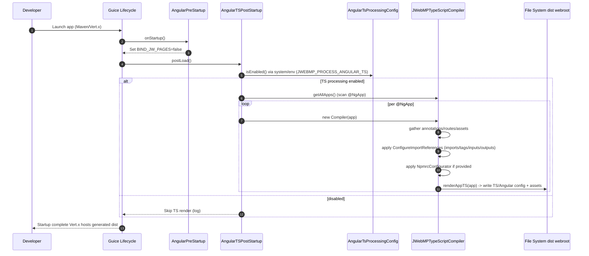

```mermaid
sequenceDiagram
    autonumber
    participant Dev as Developer
    participant Guice as Guice Lifecycle
    participant Pre as AngularPreStartup
    participant Post as AngularTSPostStartup
    participant Flag as AngularTsProcessingConfig
    participant Compiler as JWebMPTypeScriptCompiler
    participant FS as File System dist webroot

    Dev->>Guice: Launch app (Maven/Vert.x)
    Guice->>Pre: onStartup()
    Pre-->>Guice: Set BIND_JW_PAGES=false
    Guice->>Post: postLoad()
    Post->>Flag: isEnabled() via system/env (JWEBMP_PROCESS_ANGULAR_TS)
    alt TS processing enabled
        Post->>Compiler: getAllApps() (scan @NgApp)
        loop per @NgApp
            Post->>Compiler: new Compiler(app)
            Compiler->>Compiler: gather annotations/routes/assets
            Compiler->>Compiler: apply ConfigureImportReferences (imports/tags/inputs/outputs)
            Compiler->>Compiler: apply NpmrcConfigurator if provided
            Compiler->>FS: renderAppTS(app) -> write TS/Angular config + assets
        end
    else disabled
        Post-->>Guice: Skip TS render (log)
    end
    Guice-->>Dev: Startup complete Vert.x hosts generated dist
```
