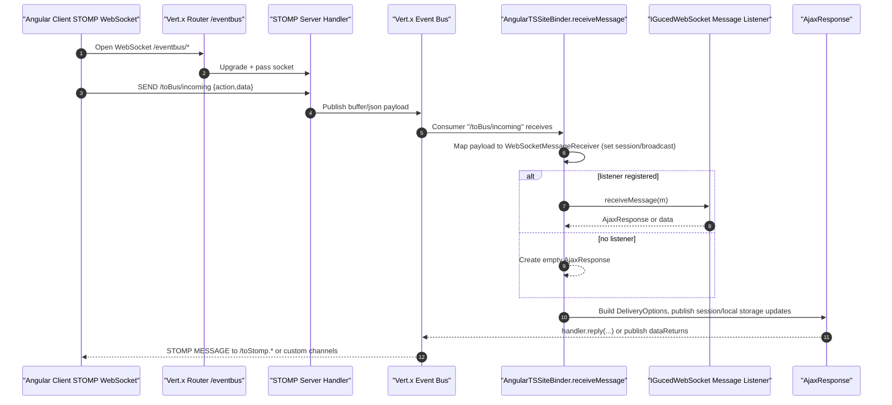

```mermaid
sequenceDiagram
    autonumber
    participant Client as "Angular Client STOMP WebSocket"
    participant Router as "Vert.x Router /eventbus"
    participant STOMP as "STOMP Server Handler"
    participant Bus as "Vert.x Event Bus"
    participant Binder as "AngularTSSiteBinder.receiveMessage"
    participant Listener as "IGucedWebSocket Message Listener"
    participant Reply as "AjaxResponse"

    Client->>Router: Open WebSocket /eventbus/*
    Router->>STOMP: Upgrade + pass socket
    Client->>STOMP: SEND /toBus/incoming {action,data}
    STOMP->>Bus: Publish buffer/json payload
    Bus->>Binder: Consumer "/toBus/incoming" receives
    Binder->>Binder: Map payload to WebSocketMessageReceiver (set session/broadcast)
    alt listener registered
        Binder->>Listener: receiveMessage(m)
        Listener-->>Binder: AjaxResponse or data
    else no listener
        Binder-->>Binder: Create empty AjaxResponse
    end
    Binder->>Reply: Build DeliveryOptions, publish session/local storage updates
    Reply-->>Bus: handler.reply(...) or publish dataReturns
    Bus-->>Client: STOMP MESSAGE to /toStomp.* or custom channels
```
